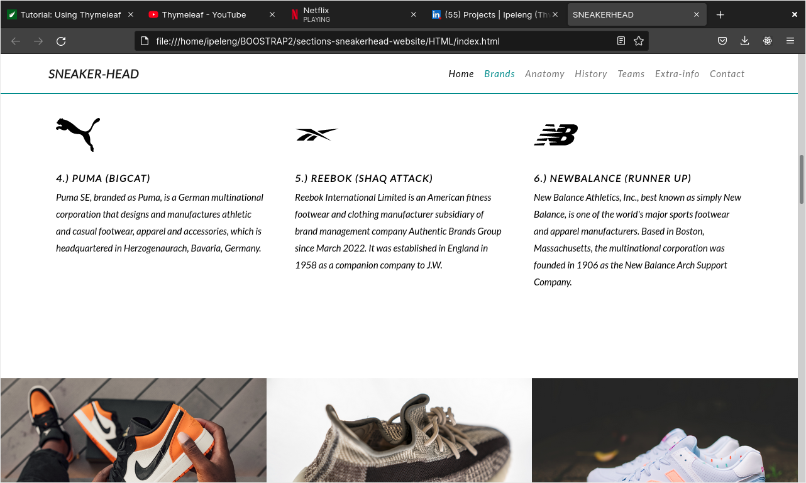

# BOOSTRAP2
projects that uses the framework boostrap on the project

Welcome to the sneaker head website where I use boostrap(framework),HTML(coding language),CSS(style langauge).

The layout of the project is based on using sections.
This means every section on the margin will have it's own section on the web page.
The website is also responsive.

I think coding can also be a way to express the things you like using zeros and ones.

=====================
HTML
CSS
BOOTSTRAP
=====================

run code using live server extention

# SNEAKERHEAD
